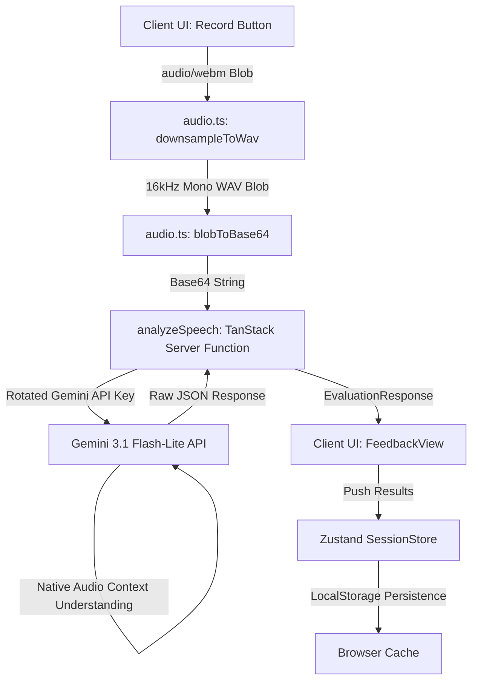
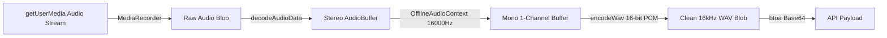
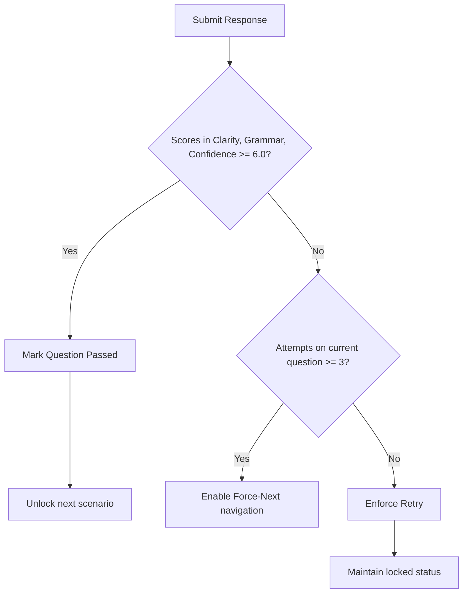

<p align="center">
  
</p>

<h1 align="center">RESONANT</h1>

<p align="center">
  <strong>Be heard. Be understood. Be remembered.</strong>
</p>

<p align="center">
  <em>"Words that resonate"</em>
</p>

<p align="center">
  
  
  
  
  
  
  
</p>

---

## 🌟 Introduction

**Resonant** is a browser-based, privacy-first AI speaking coach built specifically for non-native English speakers navigating corporate and professional environments. By bridging the gap between clinical pronunciation apps and theoretical English lessons, Resonant places users in real-world business scenarios—ranging from welcoming a teammate during a daily standup to presenting high-stakes corporate pivots to a board of directors.

At the core of Resonant is the philosophy of **candid, direct, and constructive feedback**. Rather than providing sugarcoated praises, the AI Coach evaluates speaking performances under strict professional standards. This ensures that every attempt develops real executive presence, grammar, and delivery confidence.

---

## 🚀 Key Features

*   **Multimodal Audio Evaluation**: Speaks directly to Google Gemini 3.1 Flash-Lite using raw audio base64 transmission, bypassing traditional speech-to-text API layers for higher fidelity contextual feedback.
*   **Client-Side Downsampling & WAV Encoding**: Encodes raw browser-captured audio into a compact `16kHz` mono, 16-bit PCM `audio/wav` format using browser-native `AudioContext` and `OfflineAudioContext`, drastically reducing network payload size and API latency.
*   **Three Graduated Difficulty Levels**: Includes 30 scenarios categorized by professional difficulty, each tailored with distinct time limits and script expectations:
    *   *Beginner*: Focuses on simple introductions, basic sentence flow, and comfortable pacing.
    *   *Intermediate*: Covers active meetings, constructive disagreement, and client conversations.
    *   *Advanced*: Features C-Suite board presentations, crisis control, salary negotiations, and executive narratives.
*   **Performance Metrics Dashboard**: Automatically aggregates historic performance scores, tracks level progression, visualizes strength distributions (Clarity, Grammar, and Confidence), and allows users to export/import their local progress backups.
*   **Interactive Visualizer UI**: Integrates smooth, real-time audio level animations via standard SVG waveforms (`SiriWaveVisualizer` and `OrbVisualizer`) driven directly by raw microphone decibel feedback.
*   **Robust Server-Side Key Pool & Rotation**: Supports single key or multi-key rotating configurations with automatic failover, jittered exponential backoffs, and transient rate-limit (429) recovery.

---

## 📐 Technical Architecture & Data Flow

### 1. Overall System Architecture
The application is built on top of **TanStack Start** (SSR framework) with client-side state management powered by **Zustand**. 



### 2. Audio Capture & WAV Downsampling Pipeline
Browsers record audio in high-resolution, multi-channel formats (often `44.1kHz` or `48kHz` stereo). To optimize API performance and reduce packet sizes, Resonant downsamples audio inside an offline rendering thread before transmission:



### 3. Scoring & Progression Rules
Scenarios must be completed in order. To advance, users must pass a strict scoring rubric, though safety overrides are available to prevent frustration:



---

## 📁 Directory Structure

```plaintext
RESONANT/
├── .agents/                 # AI Agent specialized skills & context documentation
├── dist/                    # Compiled production build output
├── node_modules/            # Node package dependencies
├── src/
│   ├── components/
│   │   └── resonant/        # Resonant UI & visualization components
│   │       ├── Nav.tsx               # Header navbar with "Words that resonate" tagline
│   │       ├── logo.ts               # SVG signal glyph representing Resonant
│   │       ├── OrbVisualizer.tsx     # Canvas-based pulsing 3D-effect speaking visualizer
│   │       ├── SiriWaveVisualizer.tsx# Siri-style SVG sine-wave visualizer
│   │       ├── RecordButton.tsx      # Multi-state interactive mic control
│   │       └── ScoreDial.tsx         # Circular metric score display (0-10)
│   ├── hooks/                # Custom React hook utilities
│   ├── lib/
│   │   ├── api/             # API helpers and integrations
│   │   └── resonant/        # Core speech business logic
│   │       ├── analyze.functions.ts  # TanStack Server Function + Gemini connection
│   │       ├── audio.ts              # Web Audio API WAV Downsampling pipeline
│   │       ├── funFacts.ts           # Speech facts displayed during processing
│   │       ├── personalize.ts        # String template injector for user names
│   │       ├── questions.ts          # Categorized professional scenarios (30 total)
│   │       ├── store.ts              # Zustand store with persisted profile state
│   │       └── types.ts              # TypeScript type models
│   ├── routes/              # TanStack Router app routing layer
│   │   ├── __root.tsx       # Root layout page with main stylesheet and fonts
│   │   ├── index.tsx        # Homepage containing the brand introduction
│   │   ├── setup.tsx        # Profile configuration & level assessment picker
│   │   ├── level-intro.tsx  # Dynamic introductory syllabus details per level
│   │   ├── practice.tsx     # Interactive studio page for speaking & recording
│   │   ├── complete.tsx     # Session summary reporting
│   │   └── stats.tsx        # Visual metrics dashboard & progress backup portal
│   ├── styles.css           # Global Tailwind CSS definitions & palette variables
│   ├── routeTree.gen.ts     # Auto-generated TanStack Router route tree
│   ├── router.tsx           # TanStack router setup
│   ├── server.ts            # Entrypoint node/ssr server definitions
│   └── start.ts             # Development start hooks
├── .env                     # Local environment settings
├── components.json          # Shadcn/ui component configurations
├── eslint.config.js         # Linter rules
├── package.json             # Build configurations & module packages
├── pnpm-lock.yaml           # pnpm package integrity lockfile
├── tsconfig.json            # TypeScript settings
├── vercel.json              # Serverless API execution settings
└── vite.config.ts           # Vite Bundler configurations
```

---

## 🔍 Module Deep Dive

### 🎙 Client-Side WAV Downsampler (`src/lib/resonant/audio.ts`)
The `recordAudio` function sets up real-time audio listeners, feeds an visual FFT analyser to update the visualizers at 60fps, and compiles the recorded sound chunk. When stopped, `downsampleToWav` decodes the compressed media stream in an offline thread:

```typescript
async function downsampleToWav(blob: Blob, ctx: AudioContext, targetRate: number): Promise<Blob> {
  const arrayBuffer = await blob.arrayBuffer();
  const decoded = await ctx.decodeAudioData(arrayBuffer);
  
  // Create an offline context matching the length of decoded audio at 16kHz mono
  const offline = new OfflineAudioContext(1, Math.ceil(decoded.duration * targetRate), targetRate);
  const src = offline.createBufferSource();
  src.buffer = decoded;
  src.connect(offline.destination);
  src.start(0);
  
  const rendered = await offline.startRendering();
  return encodeWav(rendered); // Writes RIFF WAVE header and raw 16-bit PCM values
}
```

### 🧠 Gemini Server Function & Failover Key Pool (`src/lib/resonant/analyze.functions.ts`)
Because evaluation is process-heavy, it runs in a TanStack Server Function (`analyzeSpeech`). To prevent rate-limiting when multiple clients practice simultaneously, the backend utilizes key rotation:

```typescript
function getKeyPool(): string[] {
  const multi = process.env.GEMINI_API_KEYS;
  if (multi) {
    return multi.split(",").map(k => k.trim()).filter(Boolean);
  }
  const single = process.env.GEMINI_API_KEY;
  return single ? [single] : [];
}

// Automatically rotates index and retries transient errors with a slight jittered delay
for (let i = 0; i < pool.length; i++) {
  const key = pool[(start + i) % pool.length];
  if (i > 0) await new Promise((r) => setTimeout(r, 200 + Math.random() * 300));
  try {
    const r = await callGemini(key, body);
    if (r.ok) return parseAndValidate(await r.json());
  } catch (e) {
    // Rotates keys on 429/5xx, fails fast on client formatting errors
  }
}
```

### 💾 Local State Rehydration & Sanitization (`src/lib/resonant/store.ts`)
To secure the user's progress without forcing them to register an account, the application relies on Zustand's `persist` middleware. Upon reload, the store sanitizes the progress list to prevent storage pollution:

```typescript
persist(
  (set) => ({
    userName: "",
    level: null,
    results: [],
    // state handlers...
  }),
  {
    name: "resonant-session",
    storage: createJSONStorage(() => localStorage),
    onRehydrateStorage: () => (state) => {
      if (state) {
        // Sanitize and cap abnormal attempt limits to keep data footprint tiny
        state.results = state.results.map((r) => ({
          ...r,
          attempts: r.attempts > 100 ? 1 : r.attempts,
        }));
      }
    },
  }
)
```

---

## 📊 Scenarios & Evaluation Framework

| Level | Estimated Time | Focus Areas | Key Scenario Examples |
| :--- | :--- | :--- | :--- |
| **Beginner** | ~8 Minutes | Foundation, clear pacing, vocabulary basics | Self-introductions, casual small talk, sharing hybrid/remote office preferences |
| **Intermediate** | ~12 Minutes | Professional tone, arguments, team alignment | Meeting leadership, structured disagreement with managers, tough feedback delivery |
| **Advanced** | ~18 Minutes | Boardroom presence, negotiations, crisis | Executive pivots, resolving teammate conflicts, handling client pricing objections |

### Evaluation Metrics
Gemini evaluates every submission along three dimensions, grading each on a `0.0 - 10.0` scale:

1.  **Clarity**: Structural layout of the answer, flow of thought, and lack of ambiguity.
2.  **Grammar**: Selection of correct tense, vocabulary levels appropriate for the scenario, and syntactic accuracy.
3.  **Confidence**: Intonation habits (such as falling tones at sentence terminations), verbal pace, and minimizing filler speech (`um`, `like`, `so`).

---

## 🛠 Project Execution & Development

### 1. Environment Configurations
Create a `.env` file in the root directory and register your Gemini API credentials:

```bash
# Register a single key
GEMINI_API_KEY=your_gemini_api_key_here

# OR Register a rotating pool of keys for high-volume use
GEMINI_API_KEYS=key_one,key_two,key_three
```

### 2. Dependency Installation
Install development dependencies using `pnpm` package manager:

```bash
pnpm install
```

### 3. Development Server
Launch the local Vite-powered TanStack Start development environment:

```bash
pnpm dev
```
The server will boot up, showing the local instance address in the terminal.

### 4. Code Quality & Compilation
Run the workspace compiler, linter, and formatters to verify system integrity:

```bash
# Run ESLint rules
pnpm lint

# Reformat code with Prettier rules
pnpm format

# Compile production bundle
pnpm build
```

---

## 🎨 Design System & Visual Aesthetics

Resonant features a curated, editorial-grade styling palette that aligns with premium web design principles. Rather than utilizing harsh default blacks or corporate blues, the styling draws inspiration from print design:

*   **Color Palette**: Harmonious selection of warm off-white cream backgrounds (`#faf9f5`), charcoal active ink accents (`#141413`), and warm coral primary themes (`#cc785c`).
*   **Typography**: Clean sans-serif headings paired with elegant serif text blocks (`Cormorant Garamond`) to elevate the user experience.
*   **Micro-Animations**: Uses customized float animations on graphic vector logos, breathing pulsing states during audio analysis, and GSAP sequence staggers for smooth slide transitions between recording stages.

---

## 📄 License

This project is licensed under the MIT License. See the [LICENSE](file:///c:/Users/Ns8pc/Music/RESONANT/LICENSE) file for details.
